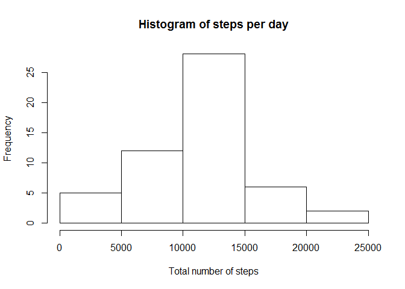
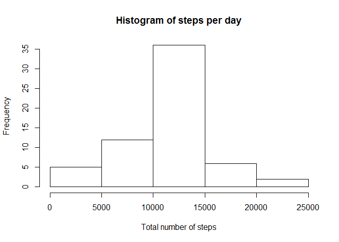
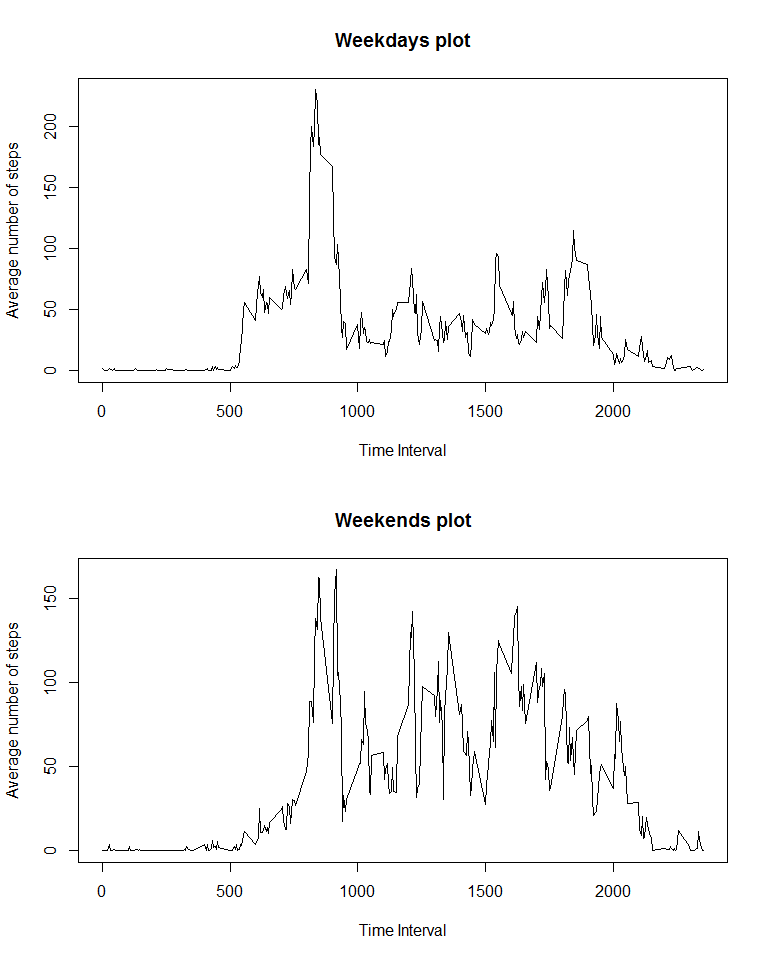

# Reproducible Research Peer Assessment 1
Daniel Ang  
July 18, 2015  

#Loading and preprocessing the data
We assume that the data file "activity.csv" is in the same directory as this file. To load the data, we simply use the read.csv function:

```r
data <- read.csv("activity.csv")
```

The data file is already in a good, tidy format (three variables), so we don't need to preprocess it before going to the next section.

#What is the mean total number of steps taken per day?
First we ignore the entries with missing data values for the column "steps":

```r
datag = data[complete.cases(data$steps),]
```
Now to calculate the total number of steps taken per day, we go through each day, adding up the number of steps:

```r
datevec <- unique(datag$date) #extract out a list of all the unique dates in the data.
totalsteps <- rep(0,length(datevec)) #create a vector to store the total steps for all the days
for (i in 1:length(datevec)){
  datedatag <- datag[datag$date == datevec[i],] #look up entries which have the specified date value 
  totalsteps[i] <- sum(datedatag$steps) #add up all the steps for that day
}                  
```
Now to create the histogram,

```r
hist(totalsteps,main = paste("Histogram of steps per day"),xlab="Total number of steps")
```

 
and then to calculate the mean and median of the number of steps,

```r
mean(totalsteps)
```

```
## [1] 10766.19
```

```r
median(totalsteps)
```

```
## [1] 10765
```

#What is the average daily activity pattern?
First we need to find the average number of steps for each time interval, which will later be the y-axis for the plot.

```r
intervalvec <- unique(datag$interval) #extract out the unique values of the intervals from the list. Note that we use the cleaned-up version of the data, "datag".

yvector <- rep(0,length(intervalvec)) #this vector will be used to store the y values for the plot. Since the x-axis will be the time intervals, the length should be the same as the number of time intervals.

for(i in 1:length(yvector)){
  intervaldatag <- datag[datag$interval == intervalvec[i],] #look up entries which have the specified interval value
  stepmean <- mean(intervaldatag$steps) #calculate mean
  yvector[i] <- stepmean #store mean in the yvector
}
```
Now we can plot the time series graph:

```r
 plot(intervalvec,yvector,type = "l",xlab="Time interval",ylab="Average number of steps")
```

 

Next, to find out the interval with the maximum average number of steps, simply find out the maximum of "yvector"

```r
nyvector <- as.numeric(yvector) #first convert yvector to numeric
intervalvec[which.max(nyvector)] #this will give the interval with the maximum number of stpes.
```

```
## [1] 835
```

#Imputing missing values
To calculate the number of rows with missing values, we only need to refer to the original data set, "data", and the cleaned up data set, "datag":

```r
nrow(data) - nrow(datag)
```

```
## [1] 2304
```

Now we need to devise a strategy to fill in the missing values. To keep it simple, let's fill the missing values with the mean for the interval. This is easy since we already have "yvector", which stores the average steps for each interval.

```r
filldataset <- data #first create a clone of the data which we will fill in for the missing values
for (i in 1:nrow(filldataset))
  if (is.na(filldataset[i,]$steps)){
    filldata <- yvector[which(intervalvec == filldataset[i,]$interval)] #find the entry in intervalvec which corresponds to the incomplete entry's interval, then note the position. As yvector and intervalvec are completely parallel to each other, we take the value of yvector in this position to get the data to fill in.
    filldataset[i,]$steps <- filldata
  }
```
Using this new dataset, we regenerate the histogram we did earlier, using similar code.
 
and then to calculate the new mean and median of the number of steps,

```r
mean(totalstepsf)
```

```
## [1] 10766.19
```

```r
median(totalstepsf)
```

```
## [1] 10766.19
```

While the mean has stayed the same, the median has increased such that it is now the same as the mean.

#Are there differences in activity patterns between weekdays and weekends?
To figure this out, we use the weekdays() function, which identifies the day of the week for a given date.

```r
datex <- as.Date(filldataset$date) #need to convert to date format first
weekdayvec <- weekdays(datex,abbr = TRUE) #find the day of the week for the dates
filldataset$day <- weekdayvec #add a field giving the day of the week

filldataset$daytype <- ifelse(filldataset$day == "Sat" | filldataset$day == "Sun","weekend","weekday") #determine whether it is a weekday or a weekend, add this as an additional variable
```
Now we create two vectors for the y-axis: one for weekdays and one for weekends. The code is similar to the one we used earlier for averages without caring about the type of day:

```r
yvectorday <- rep(0,length(intervalvec)) #we can use the same intervalvec from before as the list of intervals is the same
yvectorend <- rep(0,length(intervalvec)) 

#first we do this for weekdays
for(i in 1:length(yvectorday)){
  intervaldataf <- filldataset[filldataset$interval == intervalvec[i] & filldataset$daytype == "weekday",] #look up entries which have the specified interval value
  stepmeanday <- mean(intervaldataf$steps) #calculate mean
  yvectorday[i] <- stepmeanday #store mean in the yvector
}

#Do the same for weekends
for(i in 1:length(yvectorend)){
  intervaldataf <- filldataset[filldataset$interval == intervalvec[i] & filldataset$daytype == "weekend",] #look up entries which have the specified interval value
  stepmeanend <- mean(intervaldataf$steps) #calculate mean
  yvectorend[i] <- stepmeanend #store mean in the yvector
}
```
Now we can plot the time series graphs for both:

```r
par(mfrow=c(2,1))
plot(intervalvec,yvectorday,type = "l",xlab="Time Interval",ylab="Average number of steps",main="Weekdays plot")
plot(intervalvec,yvectorend,type = "l",xlab="Time Interval",ylab="Average number of steps",main="Weekends plot")
```

 

